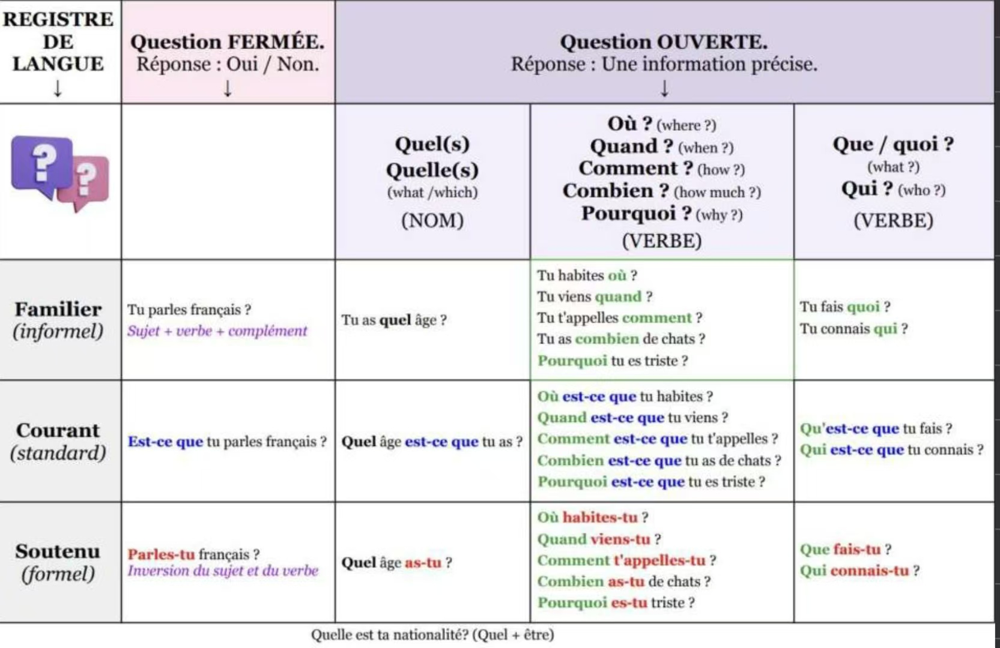

# 疑问句  
1. 一般疑问句：
   - 陈述句 + ？ 语调上扬    
   `Tu aimes le français ?`  
  
  
   - Est-ce que + 陈述句 语调不变    
    `Est-ce que tu aimes le français ?`

   - 倒装：动词 + 主语 语调上扬    
    `Aimes-tu le français ?`

1. 特殊疑问句：
   - 陈述句 + 疑问词 + ？ 语调上扬    
    `Tu aimes le français pourquoi ?` 

   - 疑问词 + 陈述句 语调上扬    
    `Pourquoi tu aimes le français ?`  
  
  
   - 疑问词 + est-ce que + 陈述句 语调不变    
    `Pourquoi est-ce que tu aimes le français ?`
      
    