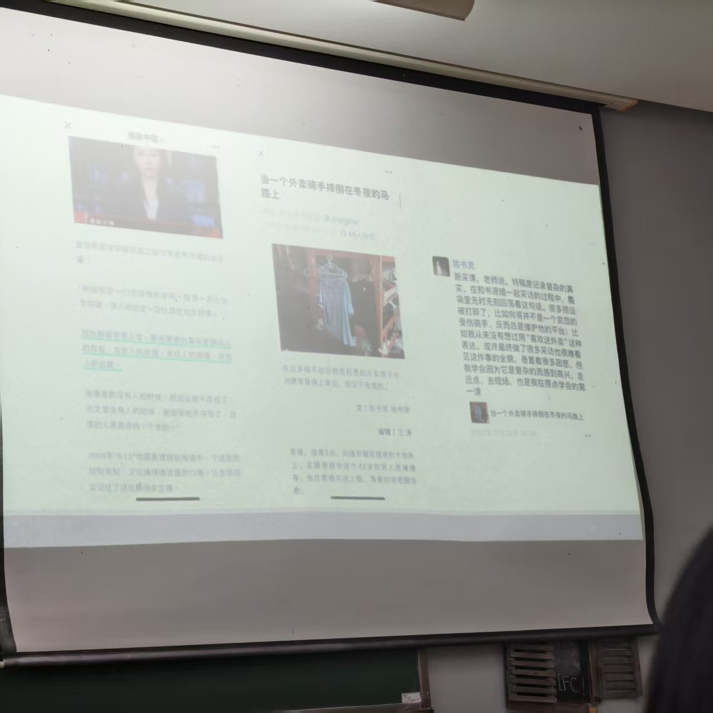
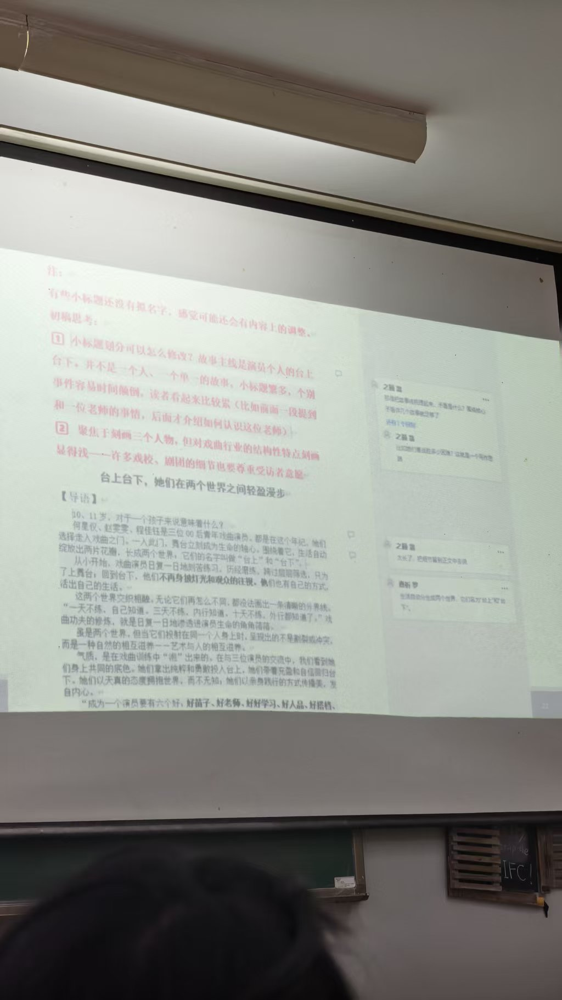
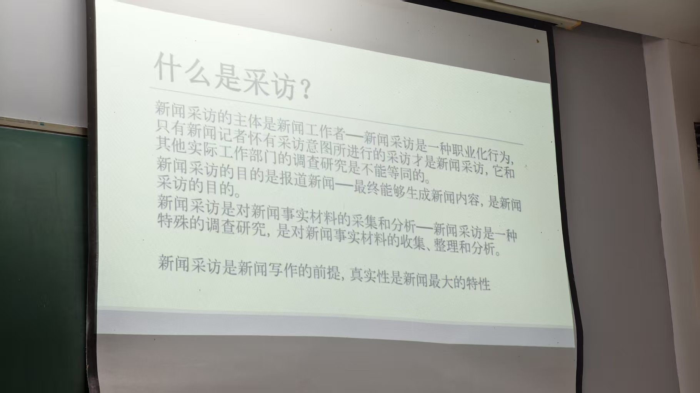

## 新闻在缩小，传播在扩大  
## AI：信息搜集，追逐溯源

### AI写不出来的：分寸感，共情力  
### 媒体一定要考虑各方面的问题，比如 美化 沙白安乐死 
[沙白安乐死](https://baijiahao.baidu.com/s?id=1813862390984233554&wfr=spider&for=pc)  
  
观点提炼：  
[新闻传播学的价值和底色](https://mp.weixin.qq.com/s/PBOxF38mActbO1OtiuY15w)  
[华科新闻学院院长回应张雪峰言论](https://mp.weixin.qq.com/s/TtcRUpq79iL1lMEA0962bg)  

内容，对于特定的环境，写特定的事情，以正确的关注对象，是那些真正需要关注的人和事：  
[新京报新年献词](https://mp.weixin.qq.com/s/Vac-5PYyuK_giGzT3cD8pA)  
[南方周报新年献词](https://mp.weixin.qq.com/s/KiAvmaFlpMjbSI2nrfskCA)

> 确认人的存在，肯定人的价值，发现人的困境，寻找人的出路  
> 
> 为弱小发生 也是AI无法替代的

  

[老师写的 “山河大学”](https://mp.weixin.qq.com/s/qsBZ7CGED5QE3lANJadkFg)  

## 课程作业

要有批注

# 什么是新闻：

- 受众： 有用的
- 媒体： 筛选过的
- 社会： 对公众有用的

> - 新近 ： 有实效性  
> - 发生 ： 新闻一定是正在发生和已经发生的事件和现实  
> - 真实 ： 新闻必须是真实，真实是新闻的本源  
> - 报道 ： 新闻本质是传播  
> - 变动 ： 能够和常态相区分也是新闻的特征  
> - 公众 ： 站在社会大众的立场，强调公众知情权  

# 什么是采访
    
新闻记者的采访过程，是采访者对客观事物的认识过程，是采访者运用自己的观点、知识积累和思维方式，通过亲自观察、倾听，经过思索而做出分析判断，最终向受众复原新闻信息的过程  
结论是危险的，过程是安全的    ？ 是否要注重采访的结论   
记者调查研究是一种特殊的调查研究工作，主要特点在于其专业性、新闻性、广泛性、实效性、连续性、公开性  
《辞海》对“采访”一词的解释是“为搜集新闻事实与新闻背景等新闻报道材料而进行的观察、访问、调查、录音、录像等活动”

## 新闻报道有什么功能?
想一想，那些你们觉得好的报道，好在哪里?“强制”你给今天澎湃新闻的推送评一个好报道,
### 第一，试图通过以下途径准确报道事实真相!
①直接观察。  
②使用权威的、灵通的、可靠的消息来源和相关的、可靠的物的消息来源。
### 第二,努力写出有趣的、及时的、清的报道。引语、故事、情节与人情味使得这些报道生动感人。
 如果说新闻工作需要规则,那么这就是起点。

1. > 传递信息的功能  
   第一时间到达现场，传回真实的信息
2. > 公共监督的功能
   民主监督，维护公共利益  
   - 阻力 ：
       - 权利
       - 商业
       - 舆论对抗
   - 如果只有负面报告，可能有什么不足：
       - 失去对政府信心
       - 社会恐慌
       - 仿效效应
       - 社会戾气
   - 建设性新闻
       - 通过新闻报道尽可能接近事情的解决方法
       - 来源于对于官方的监督，对于其不信任，存在的安全性比较高
3. > 推进社会发展的功能
   - 探寻事实真相，守护公共利益

# 记者的责任
1. > 要求记者有一定的心理素质和专业能力，以形成区别于其他职业的使命感和责任感
2. > 新闻作品是记者职业精神、价值准则、逻辑能力、采访突破能力和写作技巧的综合呈现
3. > 记者要有强烈的责任感、使命感，对整个社会负责，对人民利益负责
4. > 不要夹带私货
5. > 不断深入一线
6. > ### 不要“转录式新闻”
7. > 新闻记者需要互相帮助，互相帮助

# 学习采写的建议：
- 多阅读   广读，比较不同，排除负面
- 多练习 
- 多沟通 善于总结和改善自己在与人沟通时所展现出的精神面貌、肢体语言、遣词用句
- 多观察 多观察身边发生的变化，在正常之中看到反常 批判性思维 

[转写](../../../../lib/docs/文字转写_。的快速会议_958999958.txt)