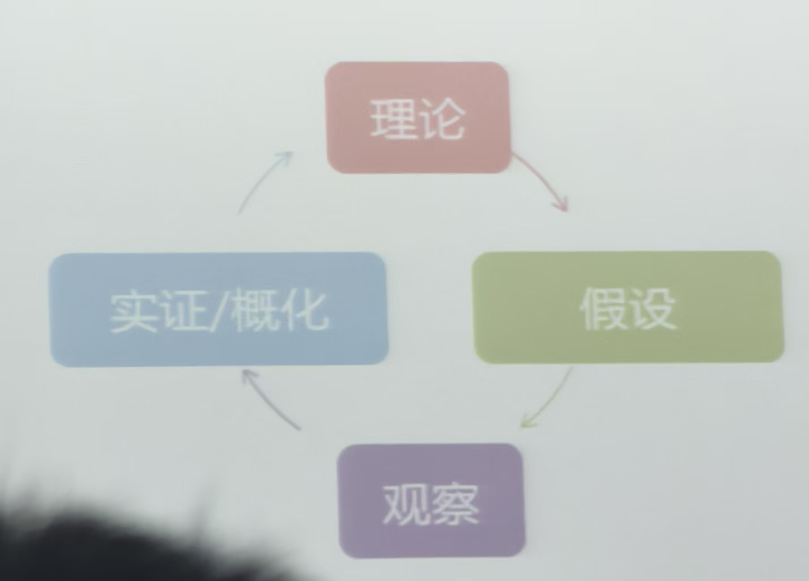
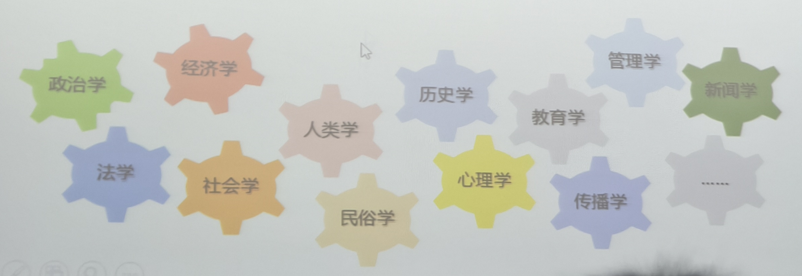
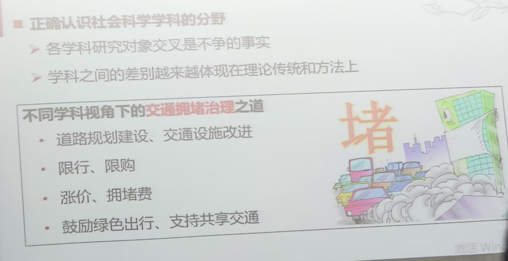
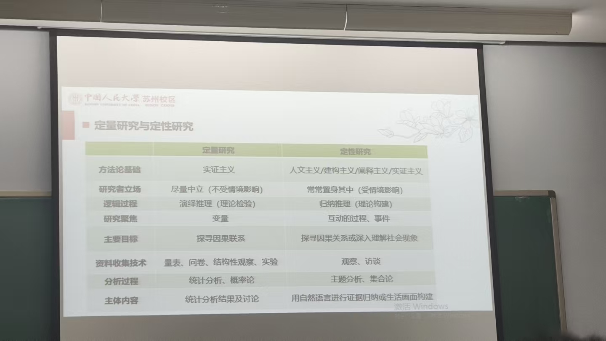
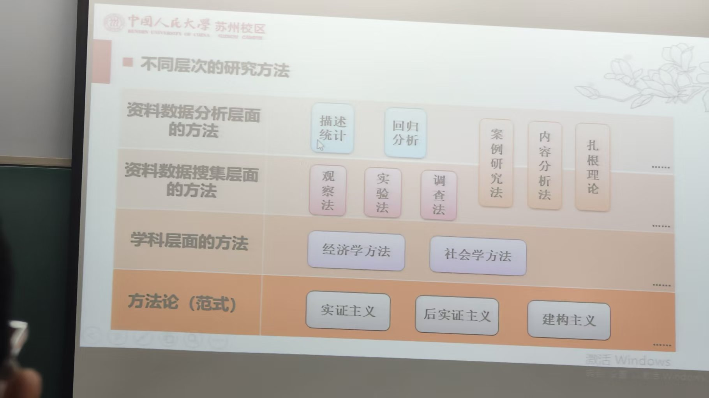

# 1. 社会的形成与发展  
    人的聚集与差异 -> 公共事务的出现与分工 -> 
    个体 -> 对偶 -> 社会 -> 国家   

#### 中国式现代化的独特性
    > 同时解决西方的现代化过程中出现的诸多问题

    ## 认识我们所处的社会
    我们常常将所见所闻视为真实，但个人感知常常存在谬误
    我们常常信奉权威，但是其有局限性
    我们常常信奉传统，但是阻碍创新
  
  
# 2. 什么是科学
- 科学是系统化的知识
- 科学是由理论组织起来的
- 科学是我们现在觉得可信、够用的知识，科学进步即对知识的否定与发展  
## 科学的任务与关注
- 科学旨在描述、解释和预测事物的产生、发展和变化
- 科学是现代社会知识的主要产生途径
- 科学关注概率和普遍规律（因果关系）
- 
### 科学注重逻辑：言之成理
- 演绎：将普通的法则运用到特定的势力上
- 归纳：将观察到的资料发展出概化的通则
### 科学强调实证：符合人们对世界的观察
- 基于来自观察和实验的事实（数据和资料），而不是思辨等
- 从事实中得出结论，而不是从他人（包括权威）的结论中推导出自己的结论，甚至不是从多数人的结论中推导出自己的结论
- 资料来源和证实形式越多元，可信度更高
- 科学是可检验的
### 社会科学：用科学的方法研究人类社会
- 社会科学坚持科学逻辑，但不唯科学主义
- 社会科学强调实证方法，但不唯实证主义
- 
### 正确认识不同学科的视角与分野
- 
# 3. 开展科学研究的方法
- 超越个人的眼界和情感
    - 基础教育学校布局之惑
- 超越廉价的批判
    - 村庄社区化管理的故事
- 超越对社会发展现实的思考
    - 注重历史思维与空间思维
    - 探寻规律与预测
- 重视方法但不要迷信方法
    - 研究方法没有优劣，只有适用与否
    - 不要迷信“定量”与模型
    - 不要不论用什么方法，先把“事件”或者“问题”讲清楚
- 常见问题
    - “神话自我”：缺乏基本的方法论素养
    - “追求宇宙真理”：盲目追求研究的宏大意义
    - “炫方法”：将方法实践本身视为研究目的
    - “不说人话”：沉迷于对数据结果的解释

# 4. 不同类型的研究方法
- 定量与定性研究：
    - 
- 不同层次的研究方法：
    -  
---
---
---
---
---
---
---
---
